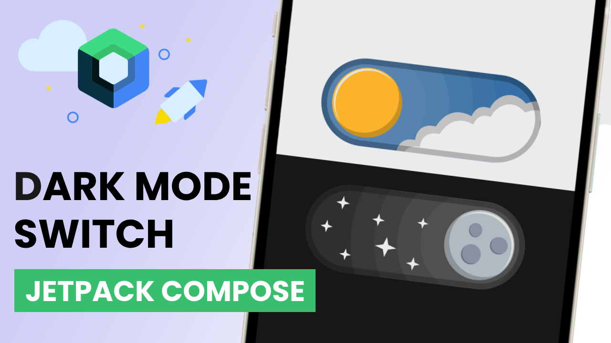

# Custom Dark Mode Switch in Jetpack Compose

## [Watch it on YouTube](https://youtu.be/44rrEVs07Co)

🚀 Dive into the world of Jetpack Compose with me! 🎨✨ I craft a custom toggle switch entirely from scratch, blending the power of Inkscape for artistic graphic elements and the magic of Kotlin to bring it to life.

🖌️ Unleash your creativity as I guide you through the process of designing each graphic element in Inkscape, ensuring a visually stunning toggle switch. Then, buckle up as we seamlessly integrate these elements into the functionality using the expressive Kotlin language in Jetpack Compose.

### Preview

